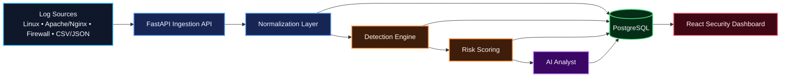
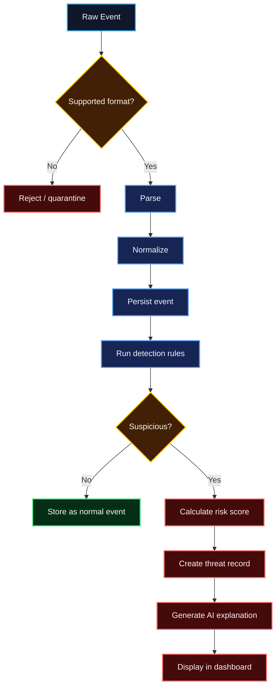

# AI Security Analyst — Project Scope & Roadmap

> **Status:** Planning / v0.1 Foundation  
> **Goal:** Build a portfolio-grade security analysis platform that ingests security logs, normalizes events, detects suspicious behavior, calculates risk, and produces analyst-friendly explanations.

## Product vision

AI Security Analyst will combine deterministic security detection with AI-assisted explanation. Detection and scoring remain explainable and auditable; AI is used to summarize evidence, add context, and help an analyst investigate.

## Architecture



## MVP scope — v0.1 to v0.3

### 1. Log ingestion
- REST endpoint: `POST /api/v1/events`
- File upload for `.log`, `.txt`, `.csv`, `.json`
- Initial log sources:
  - Linux SSH/Auth
  - Apache/Nginx access logs
  - Generic firewall logs
  - Custom CSV/JSON
- Reject malformed input safely.
- Store raw input separately from normalized event fields.

### 2. Normalized security event
Target internal representation:

```json
{
  "timestamp": "2026-09-21T20:32:14Z",
  "source_ip": "45.83.10.22",
  "destination_ip": "10.0.0.5",
  "source_port": 54321,
  "destination_port": 22,
  "protocol": "TCP",
  "event_type": "authentication_failure",
  "username": "admin",
  "source": "linux_ssh"
}
```

### 3. Detection engine
Initial deterministic detections:
- Repeated authentication failures → brute-force suspicion
- Many destination ports → port scan suspicion
- Previously flagged/banned IP → known malicious source
- Request burst → possible DoS behavior
- Successful login after repeated failures → possible account compromise

### 4. Risk scoring
Initial range:

| Score | Severity |
|---:|---|
| 0–29 | Low |
| 30–59 | Medium |
| 60–79 | High |
| 80–100 | Critical |

Risk factors should be explicit and testable. AI must **not** be the sole source of severity.

### 5. AI analyst
For detected threats, produce:
- Concise threat summary
- Evidence observed
- Why the event triggered detection
- Investigation suggestions
- Confidence/caveat language
- Optional MITRE ATT&CK mapping when supported by evidence

### 6. Dashboard
Initial pages:
- Overview
- Events
- Threats
- Threat detail
- Upload / ingestion
- Source statistics

Threat detail should include:
- Detection name
- Severity and risk score
- Source/destination details
- Evidence timeline
- Rule factors
- AI explanation
- MITRE ATT&CK mapping if available

## Detection pipeline



## Technical stack

### Backend
- Python 3.12+
- FastAPI
- Pydantic
- SQLAlchemy
- Alembic
- PostgreSQL

### Frontend
- React
- TypeScript
- Vite
- Tailwind CSS

### Infrastructure
- Docker
- Docker Compose
- GitHub Actions

### Testing
- Pytest
- API integration tests
- Parser fixtures
- Detection-rule tests

## Repository structure

```text
ai-security-analyst/
├── backend/
│   ├── app/
│   │   ├── api/
│   │   ├── core/
│   │   ├── detection/
│   │   ├── ingestion/
│   │   ├── models/
│   │   ├── normalization/
│   │   ├── schemas/
│   │   ├── services/
│   │   └── main.py
│   └── tests/
├── frontend/
│   └── src/
├── samples/
├── docs/
│   ├── architecture.md
│   ├── detection-rules.md
│   └── threat-model.md
├── .github/workflows/
├── docker-compose.yml
├── .env.example
├── .gitignore
└── README.md
```

## Delivery roadmap

### v0.1 — Foundation
- [ ] Create dedicated repository
- [ ] Create monorepo structure
- [ ] FastAPI application bootstrap
- [ ] PostgreSQL + SQLAlchemy
- [ ] Alembic migrations
- [ ] Docker + Docker Compose
- [ ] Health endpoint
- [ ] `POST /api/v1/events`
- [ ] Initial event model
- [ ] Pytest baseline
- [ ] CI workflow

### v0.2 — Detection
- [ ] SSH/Auth parser
- [ ] Apache/Nginx parser
- [ ] Generic firewall parser
- [ ] CSV/JSON ingestion
- [ ] Normalization layer
- [ ] Detection-rule framework
- [ ] Brute-force detection
- [ ] Port-scan detection
- [ ] Request-burst detection
- [ ] Risk scoring
- [ ] Threat records

### v0.3 — AI analyst
- [ ] Provider abstraction
- [ ] Structured threat summaries
- [ ] Evidence-aware prompts
- [ ] Analyst investigation suggestions
- [ ] AI output validation
- [ ] Graceful fallback when AI is unavailable

### v0.4 — Threat intelligence
- [ ] MITRE ATT&CK mappings
- [ ] IP reputation abstraction
- [ ] Threat timelines
- [ ] Source statistics
- [ ] Optional integration with existing banned-IP workflow

### v0.5 — Advanced analytics
- [ ] Behavioral baselines
- [ ] Anomaly scoring
- [ ] Cross-event correlation
- [ ] Historical comparisons

### v1.0 — Portfolio release
- [ ] Security review
- [ ] Complete tests
- [ ] Demo dataset
- [ ] Screenshots
- [ ] API documentation
- [ ] Architecture documentation
- [ ] Setup guide
- [ ] Deployment guide
- [ ] Demo deployment
- [ ] Portfolio-ready README

## v0.1 Definition of Done

The first milestone is complete when:

1. `docker compose up` starts API + PostgreSQL.
2. `GET /health` returns healthy status.
3. `POST /api/v1/events` accepts a valid security event.
4. The event is normalized and stored.
5. Invalid payloads return appropriate validation errors.
6. Tests run successfully in GitHub Actions.
7. No secrets are committed.
8. The README explains local setup.

Expected API response:

```json
{
  "id": 1,
  "status": "accepted",
  "normalized": true
}
```

## Engineering principles

- Explainable detections before opaque ML.
- Human review before automated blocking.
- No secrets or production credentials in the repository.
- Sanitized/synthetic sample logs only.
- Security rules must be unit-testable.
- Raw logs and normalized events should remain distinguishable.
- AI output must never silently overwrite deterministic evidence.
- Architecture diagrams in repository documentation must use **Mermaid code**, not generated images.
- Mermaid diagrams should use explicit classes/styles/colors for readability.

## Future integration

A later release can integrate with the existing banned-IP / potential-threat workflow. AI Security Analyst would identify and score suspicious sources; a human-approved action could then submit an IP for blocking rather than automatically enforcing network changes.

---

**Immediate next milestone:** Build **v0.1 Foundation — Core backend & log ingestion**.
