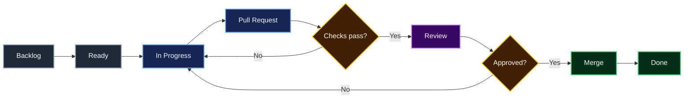

# AI Security Analyst — GitHub Project Structure

This document defines how the project should be managed in GitHub.

## Roadmap

| Version | Focus | Tracker |
|---|---|---|
| v0.1 | Foundation & Core Ingestion | #9 |
| v0.2 | Parsing, Detection & Risk Scoring | #10 |
| v0.3 | AI Analyst | #11 |
| v0.4 | Threat Intelligence & MITRE ATT&CK | #12 |
| v0.5 | Analytics, Correlation & Anomaly Detection | #13 |
| v0.9 | Security Hardening & Release Candidate | #14 |
| v1.0 | Portfolio Release | #15 |

## Recommended native GitHub Milestones

When the dedicated repository is created, create these native GitHub Milestones with the exact titles:

1. `v0.1 — Foundation & Core Ingestion`
2. `v0.2 — Parsing, Detection & Risk Scoring`
3. `v0.3 — AI Analyst`
4. `v0.4 — Threat Intelligence & MITRE ATT&CK`
5. `v0.5 — Analytics, Correlation & Anomaly Detection`
6. `v0.9 — Security Hardening & Release Candidate`
7. `v1.0 — Portfolio Release`

Native milestone descriptions should link back to the matching tracker issue.

## Recommended GitHub Project fields

Create a GitHub Project named **AI Security Analyst — Roadmap**.

Recommended fields:
- Status: Backlog / Ready / In Progress / In Review / Blocked / Done
- Priority: P0 / P1 / P2 / P3
- Version: v0.1 / v0.2 / v0.3 / v0.4 / v0.5 / v0.9 / v1.0
- Area: Backend / Frontend / Detection / AI / Data / Security / DevOps / Docs
- Size: XS / S / M / L / XL
- Type: Feature / Bug / Chore / Research / Security / Documentation
- Risk: Low / Medium / High

Recommended views:
- Roadmap by Version
- Board by Status
- Security work
- Current Milestone
- Bugs
- Documentation
- Release Readiness

## Recommended labels

### Type
- `type:feature`
- `type:bug`
- `type:chore`
- `type:research`
- `type:security`
- `type:docs`
- `type:test`

### Area
- `area:backend`
- `area:frontend`
- `area:ingestion`
- `area:normalization`
- `area:detection`
- `area:risk-scoring`
- `area:ai`
- `area:database`
- `area:devops`
- `area:security`
- `area:docs`

### Priority
- `priority:P0`
- `priority:P1`
- `priority:P2`
- `priority:P3`

### Workflow
- `status:blocked`
- `status:needs-review`
- `status:needs-design`
- `good-first-issue`
- `help-wanted`

## Issue lifecycle

## Branch strategy

- `main`: always releasable
- `feature/<issue>-short-name`
- `fix/<issue>-short-name`
- `docs/<issue>-short-name`
- `security/<issue>-short-name`

Avoid long-lived development branches.

## Pull request rules

Every non-trivial PR should:
- Link to an issue.
- Explain what changed and why.
- Include tests where behavior changes.
- Include security implications when applicable.
- Keep diagrams as Mermaid source.
- Avoid secrets, credentials, real attack data, or private infrastructure details.
- Pass CI before merge.

## Release strategy

Use semantic versions. The roadmap versions are development releases leading to `v1.0.0`.

Suggested release tags:
- `v0.1.0`
- `v0.2.0`
- `v0.3.0`
- `v0.4.0`
- `v0.5.0`
- `v0.9.0`
- `v1.0.0`

## Definition of Ready

An issue is ready when:
- Problem or outcome is clear.
- Acceptance criteria exist.
- Dependencies are identified.
- Security implications are considered.
- It is small enough for one focused PR when possible.

## Definition of Done

An issue is done when:
- Acceptance criteria are satisfied.
- Relevant tests pass.
- Documentation is updated.
- No secrets or unsafe sample data were introduced.
- CI passes.
- PR is reviewed and merged.
